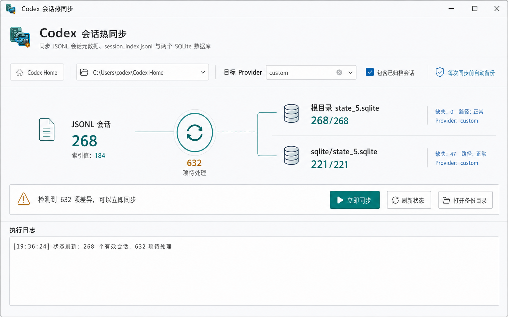

# Codex Session Management

Codex Session Management 是一款面向 Windows 的 Codex 会话同步与迁移工具。应用名称为“Codex 会话热同步”，用于在官方登录与自定义中转站配置切换后修复会话索引，并支持完整聊天记录的导入、导出和项目路径映射。



## 功能

- 同步会话 JSONL、`session_index.jsonl` 与 Codex SQLite 数据库
- 修复模型提供商切换后缺失或不可见的历史会话
- 在修改前创建一致性备份，并支持自定义备份保存路径
- 将聊天记录和关联附件压缩导出为 `.codex-chatpack`
- 导出前按项目选择需要打包的聊天记录
- 叠加导入聊天包，自动跳过同 ID 的已有会话
- 按项目选择是否导入，并将原项目路径映射到本机目录
- 导入和导出项目列表支持一键全选或取消全选
- 支持已归档会话和高 DPI 多屏环境

## 环境要求

- Windows 10/11 x64
- [.NET 10 SDK](https://dotnet.microsoft.com/download/dotnet/10.0)（从源码构建）
- WiX Toolset SDK 由安装器项目在还原时自动获取

## 构建与测试

```powershell
dotnet restore CodexSessionManagement.sln
dotnet build CodexSessionManagement.sln -c Release -p:Platform=x64
dotnet test tests/CodexSessionHotSync.Tests/CodexSessionHotSync.Tests.csproj -c Release -p:Platform=x64
```

## 运行

```powershell
dotnet run --project CodexSessionHotSync.csproj -c Release
```

默认 Codex 数据目录通常为 `%USERPROFILE%\.codex`。执行同步前建议完全退出 Codex；如果数据库仍被占用，程序会停止写入并保留备份。

## 生成安装包

当前应用版本为 `1.3.0`。先发布自包含程序，再构建 WiX 安装器：

```powershell
dotnet publish CodexSessionHotSync.csproj -c Release -r win-x64 --self-contained true -o publish/1.3.0
dotnet build installer/CodexSessionHotSync.Installer.wixproj -c Release -p:Platform=x64
```

安装包输出到 `installer/output/`。发布目录、安装包和本机聊天数据不会提交到 Git。

## 数据说明

本工具直接处理本机 Codex 会话文件。同步会生成备份，但重要数据仍建议额外保留副本。导出的 `.codex-chatpack` 可能包含完整聊天内容和附件，请按敏感文件妥善保管。
